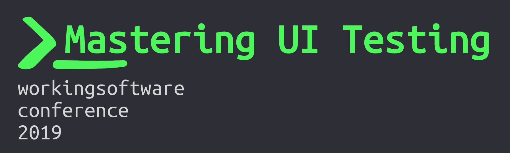

Mastering UI Testing

- [Goal of this repository](#Goal-of-this-repository)
- [About this repository](#About-this-repository)
- [How to play with it](#How-to-play-with-it)
- [How to read it](#How-to-read-it)

 

You can find the slides of the talk [here](https://slides.com/noriste/working-software-2019-mastering-ui-testing).

## Goal of this repository
I made this repository to follow up with the best practices I highlighted during my talk at the
[Working Software conference](https://www.agilemovement.it/workingsoftware/).

## About this repository
- I bootstrapped this project with [create-react-app](https://facebook.github.io/create-react-app/docs/getting-started)
- it contains a super-simple authentication form
- it contains a fake server with artificial delays to simulate E2E testing slowness
- it runs the tests in Travis too to show a complete UI Testing project
- all the code is well commented, with a lot of links to the slide explanations

## How to play with it
There are four main commands:
- `npm run start`: starts the (super simple) front-end app
- `npm run start:server`: starts the (fake) back-end app
- `npm run cy:open`: opens the Cypress UI
- `npm test`: launches both the front-end and the back-end apps, and runs cypress in the non-visual
  mode. Remember killing the manually launched apps since it uses the same ports

Please note: if you have the [Autolaunch
extension](https://marketplace.visualstudio.com/items?itemName=philfontaine.autolaunch) for VS Code,
it proposes you to launch these scripts automatically.

## How to read it

- read the [slides of the talk](https://slides.com/noriste/working-software-2019-mastering-ui-testing)
- launch the front-end app and take a look at the `src/App.js` file
- launch both the back-end app and Cypress
- launch the `authentication.integration.test.js` in Cypress and watch it running
- open the `cypress/integration/authentication.integration.test.js` and explore it
- then, move to the `cypress/integration/authentication.e2e.test.js`
- in the end: run the `npm test` command
